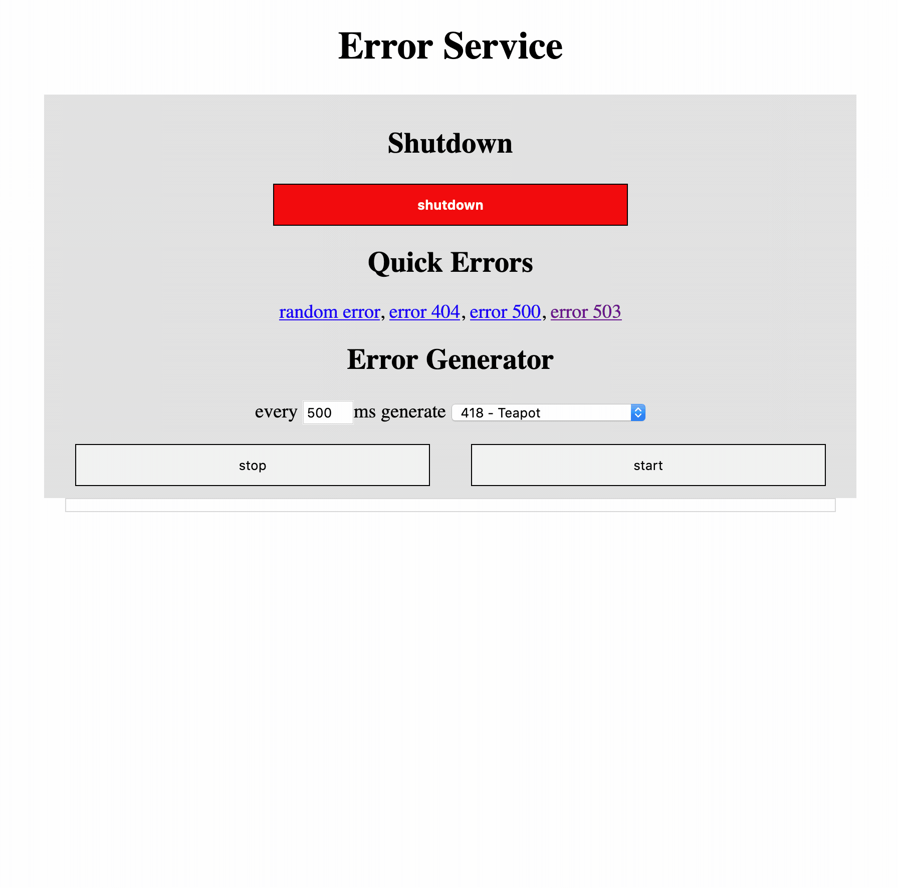

# EaaS - Error as a Service

Sometimes you need to have service, that just puts out HTTP Errors.
Either on purpose or - even better - randomly.

So here it is!

## Random errors

You can call `/errors/random` for a totally random status.  
Errors have a probability of 70%.  
There is a - hardcoded - list of Errors:

```
var errorsList = [...]int{
	http.StatusInternalServerError,
	http.StatusServiceUnavailable,
	http.StatusBadRequest,
	http.StatusBadGateway,
	http.StatusConflict}
```

## Your personal status

You can also call `/codes/xxx` for a result with that specific status code.  
Everthing above **399** counts as an error.  

## The Generator

If you go to `/` you see the generator page. 
You can click the _start_ button, and a background request will be done to `/errors/random` every 500ms.  
All errors are listed.  
You may click _stop_ if you have enough errors.  
You need to have javascript enable for that one.



## Building

You can build the service with `build.sh` - you need docker for that one. 

## Running

You can run the service with `run.sh` - you need docker for that one. 

## Pull from Docker

There is already a version present.
Just do a `docker pull phaus/error-service:latest`


Enjoy!
Leave a comment to tell me, what you are doing with this!


